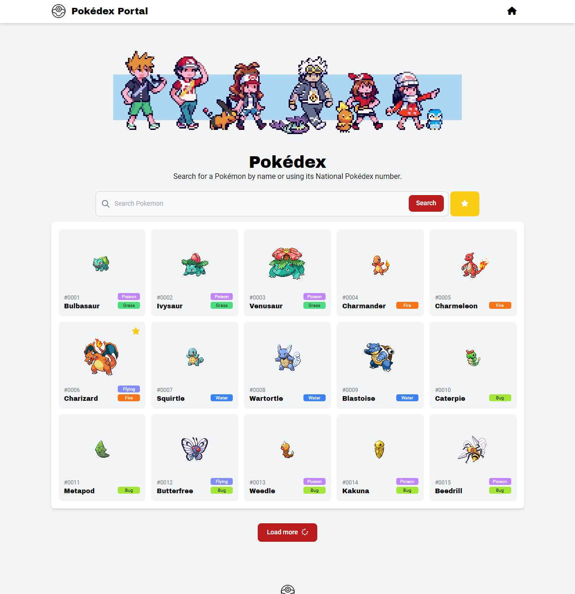
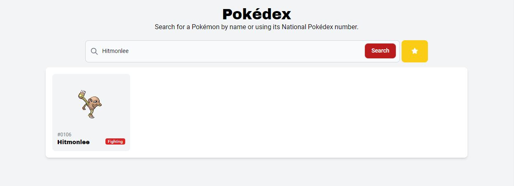
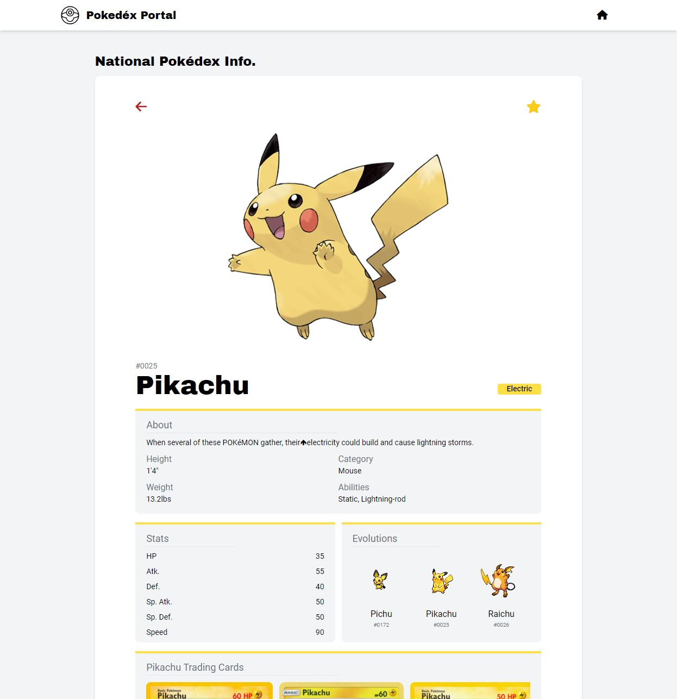
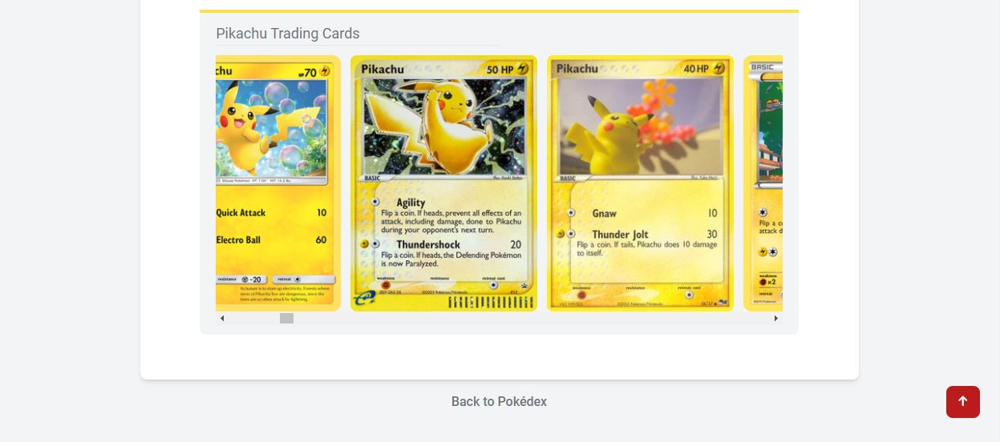

# Pokedex Web Application
OSU Bootcamp - Group 8 Project 1

Welcome to our Pokedex website, where we've combined PokeAPI and Pokemon TCG API to bring you a comprehensive database of all 1008 Pokemon from all 9 generations! Our website utilizes the powerful Tailwind CSS framework to deliver an elegant and user-friendly design that makes it easy for users to search and view Pokemon information, including their stats, evolutions, and even trading cards.

We understand that Pokemon fans of all ages have a deep passion for the franchise, and we've designed our website to cater to those needs. With our intuitive interface, you can quickly search for and access the information you need, all in one place. Plus, we're regularly updating our database to ensure that you're always up-to-date with the latest data.

So whether you're a lifelong fan or a newcomer to the world of Pokemon, we invite you to explore our website and discover everything there is to know about these amazing creatures!

## Technologies Used
[](https://tailwindcss.com/)
[](https://flowbite.com/)
[](https://developer.mozilla.org/en-US/docs/Web/JavaScript)
[](https://jquery.com/)
[](https://pokeapi.co/)
[](https://docs.pokemontcg.io/)

## User Story

```
As a User
I WANT to be able to search for information on any Pokemon from any generation
SO THAT I can be fully informed about my Pokemon encounters
As a User
I WANT to be able to save my favorite pokemon
SO THAT I can easily view their information later
```

## Acceptance Criteria

```
GIVEN I am searching for information on Pokemon
WHEN I search for a Pokemon by name
THEN I’m redirected to information on the Pokemon’s type, moveset, etc.
WHEN I want to save a Pokemon as a favorite
THEN it is saved so that I can view it later
WHEN I want to add a Pokemon to my team
THEN I can select a Pokemon from my favorites and save it in my team-builder
WHEN I want to rearrange my team
THEN I can move around my Pokemon in the order that I want use to them in a Pokemon battle
```

## Pokedex Portal Demo

The following images show the web application's appearance and functionality:

 
> **Note**: Here is a demo of our homepage. Users can search for a Pokemon by name. When using the search bar, the user will be prompted with auto-suggestions based on their keystrokes.

 
> **Note**: Demos the result of a search for the Pokemon, Hitmonlee.

 
> **Note**: When a user clicks on a Pokemon tile, they will be redirected to the Pokemon's information page. There, they can learn about the Pokemon's description, height, weight, stats, evolutions, and even view their trading cards.

 
> **Note**: On the Pokemon's information page, users can also access the Pokemon's trading cards section. By using the horizontal scroll, they can view more trading cards related to their selected Pokemon. This feature allows users to explore this Pokemon's trading cards and learn more about their favorite Pokemon's TCG history.